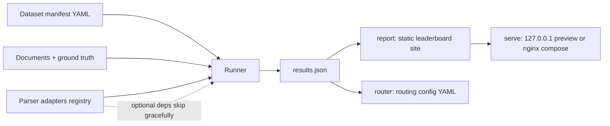

# parse-arena

[English](README.md) | [中文](README.zh.md) | [日本語](README.ja.md)

 [](LICENSE) [](CHANGELOG.md) [](https://github.com/JaydenCJ/parse-arena/issues)

**オープンソースでベンダー中立なドキュメントパーサー用ベンチマークハーネス。日本語専用トラックを内蔵。**


```bash
git clone https://github.com/JaydenCJ/parse-arena.git && cd parse-arena && pip install -e ".[pdf]"
```

## なぜ parse-arena なのか

現在見つかるドキュメントパーサーのベンチマークはすべてパーサーベンダー自身が公開したもので、勝者は常にそのベンダーです。データセットは非公開、競合の設定は検証不能で、日本語ドキュメント処理が実際に壊れるケース——縦書きテキストとレシート——を測るものはありません。parse-arena は手元で実行できる小さなハーネスです。公開 fixture、数式まで文書化されたメトリクス、データセットから leaderboard までコマンド 1 つ、そして実務でそのまま使える parser router 設定を出力します。

|  | parse-arena | ベンダーブログのベンチマーク | 学術ベンチマーク（例：OmniDocBench） |
|---|---|---|---|
| 自分で再実行できるか | 1 command (`parse-arena run`) | no dataset or harness published | research scripts, manual setup |
| スコアリングコードの監査可能性 | MIT, unit-tested formulas | closed | public |
| 日本語縦書きトラック | yes | no | no |
| 日本語レシート項目トラック | yes | no | no |
| 機械可読な出力 | router config YAML + results JSON | blog post | paper tables |

## 特徴

- **構造的に中立** — ハーネスはベンダーのパーサーを同梱せず、スコアリングコードに特定パーサーの特別扱いはありません。`mock-oracle` ベースラインにより、完全なパーサーがメトリクスパイプラインで 1.0 になることを検証できます。
- **結合セルを採点対象に** — ground truth は colspan/rowspan を保持します。テーブルメトリクスは結合セルを論理グリッドに展開するため、結合ヘッダーを黙って平坦化するパーサーは該当セルの分だけ確実に減点されます。
- **日本語トラックを標準装備** — 縦書き（vertical-rl）読み順の正解率とレシート項目の再現率で、英語のみのベンチマークが省略する失敗モードをカバーします。
- **メトリクスが透明** — CER/WER、簡易 TEDS、読み順 Kendall tau。すべての数式を下記に記載し、単体テストで検証しています。
- **コマンド 1 つで leaderboard** — `run` が results JSON を出力し、`report` がトラック切替付きの自己完結型静的サイトを生成します。再現用コマンドもページに埋め込まれます。
- **router 設定を出力** — ベンチマーク結果から `router.yaml` を生成します。（トラック、拡張子）から最適パーサーへのマッピングとして、そのままパイプラインに組み込めます。
- **アダプタの安全なスキップ** — 重量級パーサー（unstructured、markitdown）はオプション依存です。依存が無い場合は理由付きで結果に記録され、クラッシュしません。

## クイックスタート

1. インストール（Python 3.10+）:

```bash
git clone https://github.com/JaydenCJ/parse-arena.git && cd parse-arena && pip install -e ".[pdf]"
```

2. 内蔵データセットで利用可能なパーサーをすべて評価します:

```bash
parse-arena run --parsers all --out results.json
```

出力:

```text
evaluated 4 parser(s) on 11 document(s): 22 result rows -> results.json
skipped markitdown: markitdown is not installed (pip install markitdown): No module named 'markitdown'
skipped unstructured: unstructured is not installed (pip install unstructured): No module named 'unstructured'
  [en-text] best: mock-oracle (score 1.000)
  [en-table] best: mock-oracle (score 1.000)
  [en-form] best: html-stdlib (score 1.000)
  [ja-vertical] best: html-stdlib (score 1.000)
  [ja-receipt] best: mock-oracle (score 1.000)
```

3. 静的 leaderboard サイトを生成します:

```bash
parse-arena report results.json --out site
```

4. parser router 設定を生成します:

```bash
parse-arena router results.json --out router.yaml
```

5. leaderboard をローカルでプレビューします（127.0.0.1 のみにバインド）:

```bash
parse-arena serve site --port 8000
```

自前のドキュメントを評価するには、`--manifest` でデータセット manifest を指定します。スキーマ全体（ドキュメントのキー、ground truth のキー、結合セルの書き方）は後述の[データセット manifest](#データセット-manifest) を参照してください。

## メトリクス

各ドキュメントに適用されるメトリクスは ground truth の内容で決まります。ドキュメントのスコアは正規化済みメトリクス値の平均です。

| メトリクス | 必要な ground truth | 定義 | 正規化 |
|---|---|---|---|
| CER / WER | `text` | 文字／単語単位の編集距離を参照長で割った値。空白を正規化し、上限 1 | `1 - value` |
| TEDS（簡易版） | `tables` | まず両側のテーブルを論理グリッドに展開（colspan/rowspan のセルは覆う全位置を埋める）し、次に 2 段階のシーケンスアラインメント（行内でセル、テーブル内で行）。セル類似度は Levenshtein、最大行数で正規化 | そのまま |
| 読み順 tau | `blocks` | 貪欲マッチしたブロックに対する Kendall tau にマッチ被覆率を乗算 | `(value + 1) / 2` |
| 縦書き順正解率 | `blocks` + `vertical: true` | ブロックのペアが正しい「上→下・右→左」順を保っている割合 | そのまま |
| 項目再現率 | `fields` | NFKC 正規化した項目値が解析テキスト中に見つかる割合 | そのまま |

メトリクス自体はパーサー非依存です。同梱の `html-stdlib` アダプタについて 1 点だけ範囲の注記があります。縦書きの読み順は明示的なレイアウト座標（インライン CSS `left` オフセット。単位は px/pt/em/rem、または `data-left` 属性——OCR や PDF の HTML 変換ツールが出力する形式）から復元します。座標を持たない手書きの vertical-rl HTML は DOM 順で読みますが、それ自体が読み順です。座標なしの縦書き入力には OCR トラックが必要です（ロードマップ参照）。

## データセット manifest

データセットは YAML manifest と、ドキュメントごとの ground truth JSON で構成します。manifest 内のパスは manifest ファイルからの相対パスです。`documents` の各エントリで使えるキーは次のとおりです:

| キー | 必須 | 意味 |
|---|---|---|
| `id` | はい | ドキュメントの一意な識別子 |
| `file` | はい | 入力ドキュメントのパス（`.txt`、`.html`、`.pdf` など） |
| `ground_truth` | はい | ground truth JSON ファイルのパス |
| `track` | はい | leaderboard のグルーピングラベル（任意の文字列） |
| `description` | いいえ | 人間向けの自由記述メモ |

ground truth JSON のキー（すべて任意。書いたキーに対応するメトリクスが有効になります）:

| キー | 型 | 有効になるメトリクス |
|---|---|---|
| `text` | 文字列 | CER / WER（省略時は `blocks` を空行で連結） |
| `blocks` | 読み順に並べた文字列のリスト | 読み順 tau |
| `tables` | テーブルのリスト。テーブルは行のリスト、行はセルのリスト | TEDS |
| `fields` | キーも値も文字列のオブジェクト | 項目再現率 |
| `vertical` | 真偽値 | 縦書き順正解率（`blocks` と併用） |

セルは文字列そのまま、または結合セル用に `text` と任意の整数 `colspan`/`rowspan` を持つオブジェクトで書けます:

```yaml
name: my-dataset
documents:
  - id: contract-42
    file: docs/contract-42.pdf
    ground_truth: ground_truth/contract-42.json
    track: contracts
```

```json
{
  "blocks": ["Quarterly totals", "Signed on 2026-07-02."],
  "tables": [[[{"text": "Half", "colspan": 2}], ["Q1", "Q2"]]],
  "fields": {"signed_date": "2026-07-02"}
}
```

内蔵データセット `src/parse_arena/fixtures/manifest.yaml`（11 ドキュメント・5 トラック）が完全な動作例です。

## デプロイ

デプロイはコマンド 1 つで完結します。`harness` サービスがリポジトリのチェックアウトから parse-arena をインストールし、内蔵データセットでベンチマークを実行して静的サイトを named volume（`arena-site`）に書き込み、バージョン固定の nginx がそのボリュームを読み取り専用で配信します（healthcheck 付き）。`docker compose up -d` を再実行すれば再ベンチマーク・再公開されます。バックアップは通常の named volume と同じ手順です。自前のデータセットを公開するには、compose ファイル内の `parse-arena run` 行に `--manifest` を追加するか、compose を使わずローカルでサイトを生成（`parse-arena run` + `parse-arena report`）して任意の静的ファイルサーバーで配信してください。

```bash
docker compose up -d
```

```yaml
services:
  harness:
    image: python:3.11-slim
    working_dir: /work
    command:
      - /bin/sh
      - -ec
      - |
        mkdir -p /work/src
        tar -C /src -cf - --exclude=./.git --exclude=./.venv --exclude=./venv \
          --exclude=./.pytest_cache --exclude=./site --exclude=./build \
          --exclude=./dist . | tar -C /work/src -xf -
        pip install --quiet --no-cache-dir '/work/src[pdf]'
        parse-arena run --parsers all --out /work/results.json
        parse-arena report /work/results.json --out /dest
        echo 'leaderboard generated into volume'
    volumes:
      - .:/src:ro
      - arena-site:/dest
    restart: "no"
  web:
    image: nginx:1.27.3-alpine
    depends_on:
      harness:
        condition: service_completed_successfully
    ports:
      - "127.0.0.1:${PARSE_ARENA_PORT:-8080}:80"
    volumes:
      - arena-site:/usr/share/nginx/html:ro
    healthcheck:
      test: ["CMD", "wget", "-q", "--spider", "http://127.0.0.1/"]
      interval: 10s
      timeout: 3s
      retries: 5
      start_period: 5s
    restart: unless-stopped
volumes:
  arena-site:
```

サイトは `http://127.0.0.1:8080/` で閲覧できます（デフォルトは loopback のみ。ポートは `.env` の `PARSE_ARENA_PORT` で変更できます。`.env.example` を参照）。初回実行時はイメージ取得と PyPI アクセスのためネットワークが必要です。

## アーキテクチャ



## 開発

Linux でテストスイートとエンドツーエンドの smoke スクリプトを実行します:

```bash
python3 -m venv .venv && . .venv/bin/activate
pip install -e ".[dev]"
pytest
bash scripts/smoke.sh
```

直近のローカル実行では、`dev` extra 導入時に `pytest` が `157 passed in 3.67s` を出力し（pypdf なしの環境では `150 passed, 7 skipped`）、`bash scripts/smoke.sh` は `SMOKE OK` で終了します。

`dev` extra には `pdf` extra の依存（pypdf）が含まれているため、`pip install -e ".[dev]"` だけでテストスイート全体を実行できます。pypdf の無い環境では pdf 依存のテストは自動的にスキップされます。

`pytest` はメトリクス計算（結合セル展開と境界ケース含む）、manifest 検証、アダプタ登録とスキップ、重量級アダプタのフィールドマッピング（実 API と同形の stub を使用）、内蔵 fixture での評価一式、report HTML と router 生成をカバーします。`scripts/smoke.sh` は CLI の run → report → router → serve を通しで実行し、成果物を検証します。

## ロードマップ

- [x] v0.1.0：ハーネス、内蔵データセット（11 ドキュメント・5 トラック——結合セルテーブルと born-digital フォームを含む）、6 アダプタ、静的 leaderboard、router 出力
- [ ] 実世界データセットの拡充：スキャン PDF、撮影レシート、フォームレイアウトの追加
- [ ] アダプタ追加：docling、yomitoku、pdfplumber、marker
- [ ] 定期再実行によるホスト型 live leaderboard の公開
- [ ] 日本語手書きレシートトラック

全体は [open issues](https://github.com/JaydenCJ/parse-arena/issues) を参照してください。

## コントリビューション

コントリビューションを歓迎します。[CONTRIBUTING.md](CONTRIBUTING.md) を参照のうえ、まずは [good first issue](https://github.com/JaydenCJ/parse-arena/issues?q=is%3Aissue+is%3Aopen+label%3A%22good+first+issue%22) から、または [issue](https://github.com/JaydenCJ/parse-arena/issues) でお気軽にどうぞ。

## ライセンス

[MIT](LICENSE)
