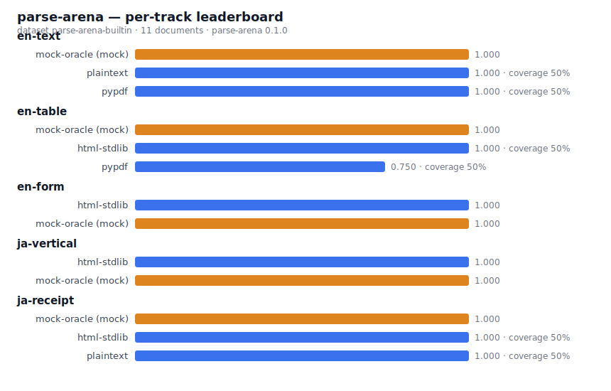
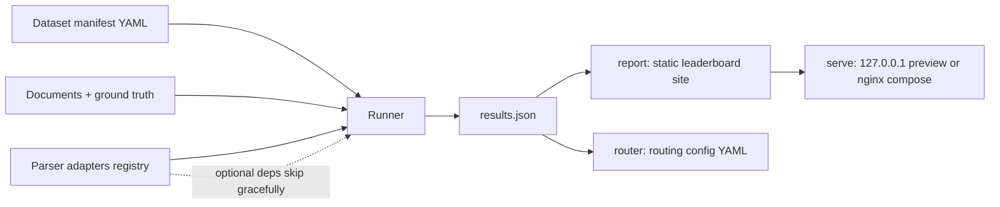

# parse-arena

[English](README.md) | [中文](README.zh.md) | [日本語](README.ja.md)

 [](LICENSE) [](CHANGELOG.md) [](https://github.com/JaydenCJ/parse-arena/issues)

**An open-source, vendor-neutral benchmark harness for document parsers, with a dedicated Japanese track.**



```bash
git clone https://github.com/JaydenCJ/parse-arena.git && cd parse-arena && pip install -e ".[pdf]"
```

## Why parse-arena?

Every document-parser benchmark you can find today is published by a parser
vendor, and the vendor's parser wins. The datasets are private, the competitor
configurations are unverifiable, and none of them measure the cases Japanese
document pipelines actually break on: vertical text and receipts. parse-arena
is a small harness you run yourself: public fixtures, documented metric
formulas, one command from dataset to leaderboard, and a router config as the
practical output.

|  | parse-arena | Vendor blog benchmarks | Academic benchmarks (e.g. OmniDocBench) |
|---|---|---|---|
| Run it yourself | 1 command (`parse-arena run`) | no dataset or harness published | research scripts, manual setup |
| Scoring code auditable | MIT, unit-tested formulas | closed | public |
| Japanese vertical-text track | yes | no | no |
| Japanese receipt-field track | yes | no | no |
| Machine-usable output | router config YAML + results JSON | blog post | paper tables |

## Features

- **Neutral by construction** — the harness ships no vendor parser and the
  scoring code special-cases nobody; a `mock-oracle` baseline proves the
  metric pipeline yields 1.0 for a perfect parser.
- **Merged cells scored, not skipped** — ground truth carries
  colspan/rowspan; the table metric expands spans onto the logical grid, so
  parsers that silently flatten a merged header lose exactly those cells.
- **Japanese track built in** — vertical-rl reading-order accuracy and
  receipt field recall cover the failure modes English-only benchmarks skip.
- **Transparent metrics** — CER/WER, simplified TEDS, reading-order Kendall
  tau; every formula is documented below and unit-tested.
- **One command to a leaderboard** — `run` produces results JSON, `report`
  renders a self-contained static site with per-track switching and the exact
  reproduce command embedded.
- **Router config output** — benchmark results become a `router.yaml` that
  maps (track, file extension) to the best parser, ready for your pipeline.
- **Graceful adapter skipping** — heavyweight parsers (unstructured,
  markitdown) are optional imports; a missing dependency is reported in the
  results, never a crash.

## Quickstart

1. Install (Python 3.10+):

```bash
git clone https://github.com/JaydenCJ/parse-arena.git && cd parse-arena && pip install -e ".[pdf]"
```

2. Evaluate all available parsers on the built-in dataset:

```bash
parse-arena run --parsers all --out results.json
```

Output:

```text
evaluated 4 parser(s) on 11 document(s): 22 result rows -> results.json
skipped markitdown: markitdown is not installed (pip install markitdown): No module named 'markitdown'
skipped unstructured: unstructured is not installed (pip install unstructured): No module named 'unstructured'
  [en-text] best: mock-oracle (score 1.000)
  [en-table] best: mock-oracle (score 1.000)
  [en-form] best: html-stdlib (score 1.000)
  [ja-vertical] best: html-stdlib (score 1.000)
  [ja-receipt] best: mock-oracle (score 1.000)
```

3. Render the static leaderboard site:

```bash
parse-arena report results.json --out site
```

4. Generate the parser-router config:

```bash
parse-arena router results.json --out router.yaml
```

5. Preview the leaderboard locally (binds 127.0.0.1 only):

```bash
parse-arena serve site --port 8000
```

To benchmark your own documents, point `--manifest` at a dataset manifest —
the full schema (document keys, ground-truth keys, merged-cell syntax) is in
[Dataset manifest](#dataset-manifest) below.

## Metrics

Which metrics apply to a document is decided by its ground truth; the
per-document score is the mean of the normalized metric values.

| Metric | Ground truth needed | Definition | Normalization |
|---|---|---|---|
| CER / WER | `text` | edit distance over characters / words divided by reference length, whitespace-normalized, clipped at 1 | `1 - value` |
| TEDS (simplified) | `tables` | both tables are first expanded onto the logical grid (colspan/rowspan cells fill every position they cover), then two-level sequence alignment (cells within rows, rows within tables) with Levenshtein cell similarity, normalized by max row count | as is |
| Reading-order tau | `blocks` | Kendall tau over greedily matched blocks, multiplied by match coverage | `(value + 1) / 2` |
| Vertical-order accuracy | `blocks` + `vertical: true` | fraction of block pairs kept in correct top-bottom / right-left order | as is |
| Field recall | `fields` | fraction of NFKC-normalized field values found in the parsed text | as is |

The metrics are parser-agnostic. One scope note on the bundled `html-stdlib`
adapter: it reconstructs vertical reading order from explicit layout geometry
(inline CSS `left` offsets in px/pt/em/rem, or `data-left` attributes — the
shape OCR-to-HTML and PDF-to-HTML converters emit); hand-authored vertical-rl
HTML without geometry is read in DOM order, which is already its reading
order. Coordinate-free vertical input from other sources needs an OCR track
(see Roadmap).

## Dataset manifest

A dataset is a YAML manifest plus one ground-truth JSON per document; paths
inside the manifest are resolved relative to the manifest file. Each entry in
`documents` accepts exactly these keys:

| Key | Required | Meaning |
|---|---|---|
| `id` | yes | unique document identifier |
| `file` | yes | path to the input document (`.txt`, `.html`, `.pdf`, ...) |
| `ground_truth` | yes | path to the ground-truth JSON file |
| `track` | yes | leaderboard grouping label (any string) |
| `description` | no | free-form note for humans |

Ground-truth JSON keys (all optional; each key enables its metrics):

| Key | Type | Enables |
|---|---|---|
| `text` | string | CER / WER (defaults to `blocks` joined by blank lines) |
| `blocks` | list of strings in reading order | reading-order tau |
| `tables` | list of tables, each a list of rows of cells | TEDS |
| `fields` | object of key/value strings | field recall |
| `vertical` | boolean | vertical-order accuracy (together with `blocks`) |

A table cell is a plain string, or an object with `text` plus optional
`colspan`/`rowspan` integers for merged cells:

```yaml
name: my-dataset
documents:
  - id: contract-42
    file: docs/contract-42.pdf
    ground_truth: ground_truth/contract-42.json
    track: contracts
```

```json
{
  "blocks": ["Quarterly totals", "Signed on 2026-07-02."],
  "tables": [[[{"text": "Half", "colspan": 2}], ["Q1", "Q2"]]],
  "fields": {"signed_date": "2026-07-02"}
}
```

The built-in dataset at `src/parse_arena/fixtures/manifest.yaml` (11
documents, 5 tracks) is a complete working example.

## Deployment

One command deploys the whole thing: the `harness` service installs
parse-arena from the repository checkout, benchmarks the built-in dataset and
writes the static site into the `arena-site` named volume; a version-pinned
nginx serves the volume read-only with a healthcheck. Re-run
`docker compose up -d` to re-benchmark and re-publish; back the volume up
like any other named volume. To publish your own dataset, add `--manifest`
to the `parse-arena run` line in the compose file — or skip compose entirely,
generate the site locally (`parse-arena run` + `parse-arena report`) and host
the directory with any static file server.

```bash
docker compose up -d
```

```yaml
services:
  harness:
    image: python:3.11-slim
    working_dir: /work
    command:
      - /bin/sh
      - -ec
      - |
        mkdir -p /work/src
        tar -C /src -cf - --exclude=./.git --exclude=./.venv --exclude=./venv \
          --exclude=./.pytest_cache --exclude=./site --exclude=./build \
          --exclude=./dist . | tar -C /work/src -xf -
        pip install --quiet --no-cache-dir '/work/src[pdf]'
        parse-arena run --parsers all --out /work/results.json
        parse-arena report /work/results.json --out /dest
        echo 'leaderboard generated into volume'
    volumes:
      - .:/src:ro
      - arena-site:/dest
    restart: "no"
  web:
    image: nginx:1.27.3-alpine
    depends_on:
      harness:
        condition: service_completed_successfully
    ports:
      - "127.0.0.1:${PARSE_ARENA_PORT:-8080}:80"
    volumes:
      - arena-site:/usr/share/nginx/html:ro
    healthcheck:
      test: ["CMD", "wget", "-q", "--spider", "http://127.0.0.1/"]
      interval: 10s
      timeout: 3s
      retries: 5
      start_period: 5s
    restart: unless-stopped
volumes:
  arena-site:
```

The site is then at `http://127.0.0.1:8080/` (loopback only by default; set
`PARSE_ARENA_PORT` in `.env`, see `.env.example`). The first run needs
network access for the image pulls and PyPI.

## Architecture



## Development

Run the test suite and the end-to-end smoke script on Linux:

```bash
python3 -m venv .venv && . .venv/bin/activate
pip install -e ".[dev]"
pytest
bash scripts/smoke.sh
```

Latest local run: `pytest` reports `157 passed in 3.67s` with the `dev` extra installed (`150 passed, 7 skipped` without pypdf); `bash scripts/smoke.sh` ends with `SMOKE OK`.

The `dev` extra already includes the `pdf` extra's dependency (pypdf), so `pip install -e ".[dev]"` alone runs the full test suite; in an environment without pypdf the pdf-dependent tests are skipped automatically.

`pytest` covers metrics (including span expansion and edge cases), manifest
validation, adapter registration and graceful skipping, the heavyweight
adapters' field mapping against API-shaped stubs, the full evaluation on the
built-in fixtures, report HTML and router generation. `scripts/smoke.sh`
exercises the CLI chain run → report → router → serve and asserts on the
artifacts.

## Roadmap

- [x] v0.1.0: harness, built-in dataset (11 documents, 5 tracks — including merged-cell tables and a born-digital form), 6 adapters, static leaderboard, router output
- [ ] Real-world dataset expansion: scanned PDFs, photographed receipts, more form layouts
- [ ] More adapters: docling, yomitoku, pdfplumber, marker
- [ ] Scheduled re-runs publishing a hosted live leaderboard
- [ ] Japanese handwritten-receipt track

See the [open issues](https://github.com/JaydenCJ/parse-arena/issues) for the full list.

## Contributing

Contributions are welcome — see [CONTRIBUTING.md](CONTRIBUTING.md), start with a [good first issue](https://github.com/JaydenCJ/parse-arena/issues?q=is%3Aissue+is%3Aopen+label%3A%22good+first+issue%22) or open an [issue](https://github.com/JaydenCJ/parse-arena/issues).

## License

[MIT](LICENSE)
