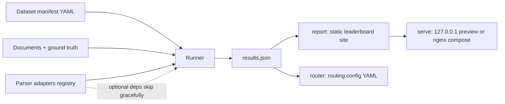

# parse-arena

[English](README.md) | [中文](README.zh.md) | [日本語](README.ja.md)

 [](LICENSE) [](CHANGELOG.md) [](https://github.com/JaydenCJ/parse-arena/issues)

**开源、厂商中立的文档解析器基准评测框架，内置专属日语赛道。**


```bash
git clone https://github.com/JaydenCJ/parse-arena.git && cd parse-arena && pip install -e ".[pdf]"
```

## 为什么是 parse-arena？

今天能找到的文档解析器 benchmark 全部出自解析器厂商之手，而且赢家总是厂商自己。数据集不公开、竞品配置无法核实，更没有人测日语文档管线真正会翻车的场景：竖排文本和收据。parse-arena 是一个自己就能跑的小型评测框架：公开 fixture、有公式可查的指标、一条命令从数据集到 leaderboard，并把结果落成可直接使用的 parser router 配置。

|  | parse-arena | 厂商博客 benchmark | 学术 benchmark（如 OmniDocBench） |
|---|---|---|---|
| 自己可复跑 | 1 command (`parse-arena run`) | no dataset or harness published | research scripts, manual setup |
| 评分代码可审计 | MIT, unit-tested formulas | closed | public |
| 日语竖排赛道 | yes | no | no |
| 日语收据字段赛道 | yes | no | no |
| 机器可用的产出 | router config YAML + results JSON | blog post | paper tables |

## 特性

- **结构性中立** —— 框架不内置任何厂商解析器，评分代码不给任何一家开后门；`mock-oracle` 基线可证明完美解析器在指标管线上得 1.0。
- **合并单元格计分，不再跳过** —— ground truth 携带 colspan/rowspan；表格指标把跨行列单元格展开到逻辑网格上，静默压平合并表头的解析器恰好丢掉这些单元格的分。
- **日语赛道内置** —— 竖排（vertical-rl）阅读顺序正确率与收据字段召回，覆盖纯英文 benchmark 跳过的失败模式。
- **指标透明** —— CER/WER、简化 TEDS、阅读顺序 Kendall tau；每个公式都写在下文并有单元测试。
- **一条命令出 leaderboard** —— `run` 产出 results JSON，`report` 渲染自包含静态站，支持赛道切换并内嵌可复现命令。
- **输出 router 配置** —— 评测结果生成 `router.yaml`，把（赛道、文件扩展名）映射到最优解析器，可直接接入管线。
- **适配器优雅降级** —— 重量级解析器（unstructured、markitdown）为可选依赖；依赖缺失会记录进结果，绝不崩溃。

## 快速开始

1. 安装（Python 3.10+）：

```bash
git clone https://github.com/JaydenCJ/parse-arena.git && cd parse-arena && pip install -e ".[pdf]"
```

2. 在内置数据集上评测所有可用解析器：

```bash
parse-arena run --parsers all --out results.json
```

输出：

```text
evaluated 4 parser(s) on 11 document(s): 22 result rows -> results.json
skipped markitdown: markitdown is not installed (pip install markitdown): No module named 'markitdown'
skipped unstructured: unstructured is not installed (pip install unstructured): No module named 'unstructured'
  [en-text] best: mock-oracle (score 1.000)
  [en-table] best: mock-oracle (score 1.000)
  [en-form] best: html-stdlib (score 1.000)
  [ja-vertical] best: html-stdlib (score 1.000)
  [ja-receipt] best: mock-oracle (score 1.000)
```

3. 渲染静态 leaderboard 站点：

```bash
parse-arena report results.json --out site
```

4. 生成 parser router 配置：

```bash
parse-arena router results.json --out router.yaml
```

5. 本地预览 leaderboard（只绑定 127.0.0.1）：

```bash
parse-arena serve site --port 8000
```

要评测自己的文档，用 `--manifest` 指向数据集 manifest——完整 schema（文档字段、ground truth 字段、合并单元格写法）见下文[数据集 manifest](#数据集-manifest)。

## 指标

一个文档适用哪些指标由其 ground truth 决定；单文档得分是各指标归一化值的平均。

| 指标 | 所需 ground truth | 定义 | 归一化 |
|---|---|---|---|
| CER / WER | `text` | 字符/词级编辑距离除以参考长度，空白归一化，上限 1 | `1 - value` |
| TEDS（简化） | `tables` | 先把两侧表格按跨行列展开到逻辑网格（colspan/rowspan 单元格填满其覆盖的所有位置），再做两级序列对齐（行内对齐单元格、表内对齐行），单元格用 Levenshtein 相似度，按最大行数归一化 | 原值 |
| 阅读顺序 tau | `blocks` | 对贪心匹配后的块计算 Kendall tau，再乘以匹配覆盖率 | `(value + 1) / 2` |
| 竖排顺序正确率 | `blocks` + `vertical: true` | 块两两之间保持正确「上→下、右→左」顺序的比例 | 原值 |
| 字段召回 | `fields` | NFKC 归一化后字段值在解析文本中出现的比例 | 原值 |

指标本身与解析器无关。对内置 `html-stdlib` 适配器的一点范围说明：它依据显式布局几何信息（内联 CSS `left` 偏移，单位 px/pt/em/rem，或 `data-left` 属性——OCR 转 HTML、PDF 转 HTML 工具输出的形态）恢复竖排阅读顺序；无几何信息的手写 vertical-rl HTML 按 DOM 顺序读取，而这本来就是其阅读顺序。来自其它来源、不带坐标的竖排输入需要 OCR 赛道（见路线图）。

## 数据集 manifest

一个数据集 = 一份 YAML manifest + 每个文档一份 ground truth JSON；manifest 内的路径相对 manifest 文件解析。`documents` 中每个条目只接受以下字段：

| 字段 | 必填 | 含义 |
|---|---|---|
| `id` | 是 | 文档唯一标识 |
| `file` | 是 | 输入文档路径（`.txt`、`.html`、`.pdf` 等） |
| `ground_truth` | 是 | ground truth JSON 文件路径 |
| `track` | 是 | leaderboard 分组标签（任意字符串） |
| `description` | 否 | 给人看的自由备注 |

ground truth JSON 字段（全部可选；写了哪个字段就启用对应指标）：

| 字段 | 类型 | 启用 |
|---|---|---|
| `text` | 字符串 | CER / WER（缺省为 `blocks` 用空行连接） |
| `blocks` | 按阅读顺序排列的字符串列表 | 阅读顺序 tau |
| `tables` | 表格列表，每个表格是行的列表、行是单元格列表 | TEDS |
| `fields` | 键值均为字符串的对象 | 字段召回 |
| `vertical` | 布尔值 | 竖排顺序正确率（与 `blocks` 搭配） |

单元格可以是纯字符串，也可以是带 `text` 与可选 `colspan`/`rowspan` 整数的对象（合并单元格）：

```yaml
name: my-dataset
documents:
  - id: contract-42
    file: docs/contract-42.pdf
    ground_truth: ground_truth/contract-42.json
    track: contracts
```

```json
{
  "blocks": ["Quarterly totals", "Signed on 2026-07-02."],
  "tables": [[[{"text": "Half", "colspan": 2}], ["Q1", "Q2"]]],
  "fields": {"signed_date": "2026-07-02"}
}
```

内置数据集 `src/parse_arena/fixtures/manifest.yaml`（11 文档、5 赛道）是一份完整的可运行示例。

## 部署

一条命令完成整个部署：`harness` 服务从仓库检出安装 parse-arena，在内置数据集上跑评测并把静态站写入 named volume（`arena-site`）；固定版本的 nginx 以只读方式提供该卷，带 healthcheck。重跑 `docker compose up -d` 即重新评测并重新发布；卷的备份方式与任何 named volume 相同。要发布自己的数据集，在 compose 文件的 `parse-arena run` 行加上 `--manifest`——或者完全不用 compose，本地生成站点（`parse-arena run` + `parse-arena report`）后用任意静态文件服务器托管该目录。

```bash
docker compose up -d
```

```yaml
services:
  harness:
    image: python:3.11-slim
    working_dir: /work
    command:
      - /bin/sh
      - -ec
      - |
        mkdir -p /work/src
        tar -C /src -cf - --exclude=./.git --exclude=./.venv --exclude=./venv \
          --exclude=./.pytest_cache --exclude=./site --exclude=./build \
          --exclude=./dist . | tar -C /work/src -xf -
        pip install --quiet --no-cache-dir '/work/src[pdf]'
        parse-arena run --parsers all --out /work/results.json
        parse-arena report /work/results.json --out /dest
        echo 'leaderboard generated into volume'
    volumes:
      - .:/src:ro
      - arena-site:/dest
    restart: "no"
  web:
    image: nginx:1.27.3-alpine
    depends_on:
      harness:
        condition: service_completed_successfully
    ports:
      - "127.0.0.1:${PARSE_ARENA_PORT:-8080}:80"
    volumes:
      - arena-site:/usr/share/nginx/html:ro
    healthcheck:
      test: ["CMD", "wget", "-q", "--spider", "http://127.0.0.1/"]
      interval: 10s
      timeout: 3s
      retries: 5
      start_period: 5s
    restart: unless-stopped
volumes:
  arena-site:
```

站点随后可在 `http://127.0.0.1:8080/` 访问（默认仅回环地址；端口在 `.env` 中用 `PARSE_ARENA_PORT` 配置，参见 `.env.example`）。首次运行需要网络以拉取镜像与访问 PyPI。

## 架构



## 开发

在 Linux 上运行测试套件与端到端 smoke 脚本：

```bash
python3 -m venv .venv && . .venv/bin/activate
pip install -e ".[dev]"
pytest
bash scripts/smoke.sh
```

最近一次本地实跑：装有 `dev` extra 时 `pytest` 输出 `157 passed in 3.67s`（无 pypdf 环境为 `150 passed, 7 skipped`）；`bash scripts/smoke.sh` 以 `SMOKE OK` 结束。

`dev` extra 已包含 `pdf` extra 的依赖（pypdf），因此只需 `pip install -e ".[dev]"` 即可运行完整测试套件；在没有 pypdf 的环境中，依赖 pdf 的测试会自动跳过。

`pytest` 覆盖指标计算（含跨行列展开与边界情况）、manifest 校验、适配器注册与优雅跳过、重量级适配器字段映射（基于与真实 API 同形的 stub）、内置 fixture 上的完整评测、report HTML 与 router 生成。`scripts/smoke.sh` 走通 CLI 全链路 run → report → router → serve 并对产物断言。

## 路线图

- [x] v0.1.0：评测框架、内置数据集（11 文档、5 赛道——含合并单元格表格与 born-digital 表单）、6 个适配器、静态 leaderboard、router 输出
- [ ] 真实世界数据集扩充：扫描 PDF、拍照收据、更多表单版式
- [ ] 更多适配器：docling、yomitoku、pdfplumber、marker
- [ ] 定时复跑并发布托管的 live leaderboard
- [ ] 日语手写收据赛道

完整列表见 [open issues](https://github.com/JaydenCJ/parse-arena/issues)。

## 参与贡献

欢迎贡献——见 [CONTRIBUTING.md](CONTRIBUTING.md)，从 [good first issue](https://github.com/JaydenCJ/parse-arena/issues?q=is%3Aissue+is%3Aopen+label%3A%22good+first+issue%22) 入手，或直接提一个 [issue](https://github.com/JaydenCJ/parse-arena/issues)。

## 许可证

[MIT](LICENSE)
